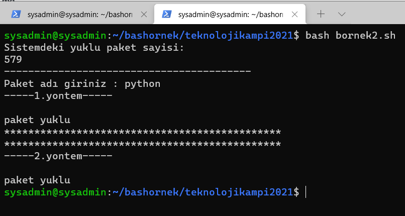
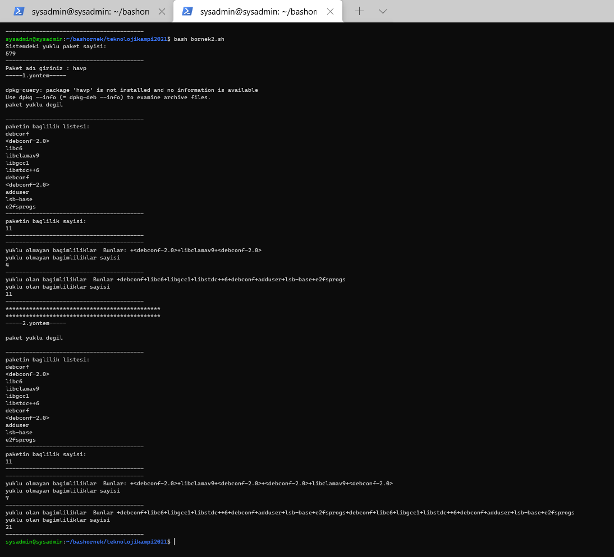

<h1> Ekran Görüntüleri </h1>

<h5>Yüklü ise</h5>

Not: Yüklü ise sorunsuz çalışıyor.
 
<h5>Yüklü değil ise</h5>

Not: "+" lardan dolayı sistemde yüklü olan ve olmaya paket saysını yanlış sayıyor.

# teknolojikampi2021
Açıklab Pardus ve Liman Teknoloji Kampı

Bir linux sunucu üzerinde çalıştırılacak python scripti (yapabilen bash de yapabilir ;D ) ile aşağıdaki işlemler yapılacaktır; 
- Genel sorgu fonksiyonu

  Bu fonksiyon değişken almamaktadır
  - İşletim sistemindeki kurulu paket sayısını ekrana yazdırma

- Bir paket sorgusu

  Bu fonksiyon girdi olarak bir paket adı almaktadır
  - Değişken olarak verilen bir paketin kurulu olup olmadığını ekrana yazdırma
  - Değişken olarak verilen ve yüklü olmayan bir paketin kaç adet bağımlılığa sahip olduğunun listelenmesi
  - Değişken olarak verilen ve yüklü olmayan bir paketin kaç adet bağımlıklarından yüklü olanların ve olmayanların ayrı ayrı listelenmesi 
  - Yine aynı paketin kaç adet bağımlılığının yükleneceğinin ekrana yazdırılması

# Anahtar Kelimeler
- python
  -  apt_pkg modülü
  -  apt modülü
  -  apt_deps modülü
-  bash 
  -  dpkg komutu
  -  apt komutu
